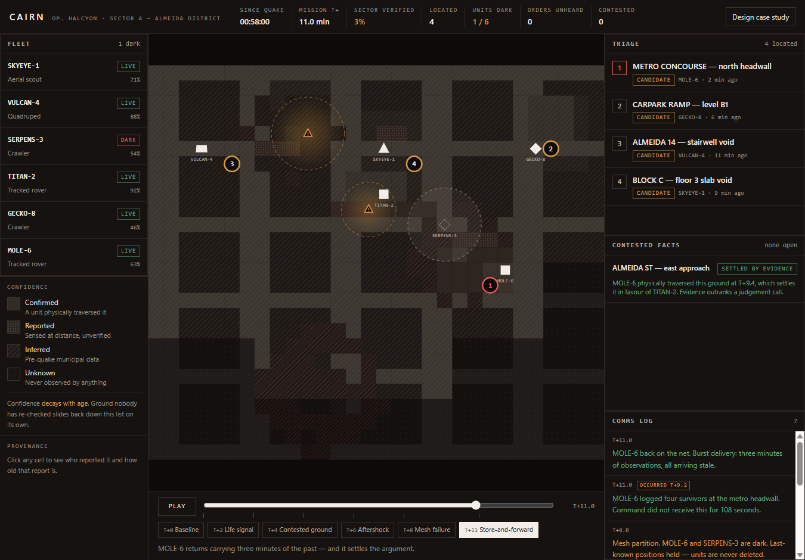
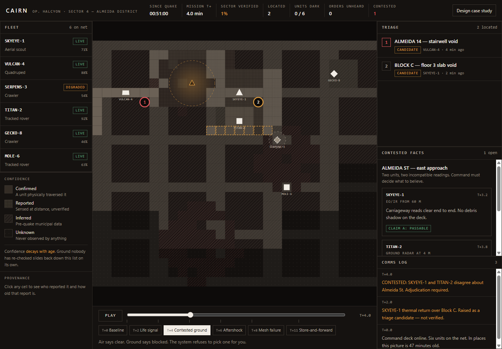
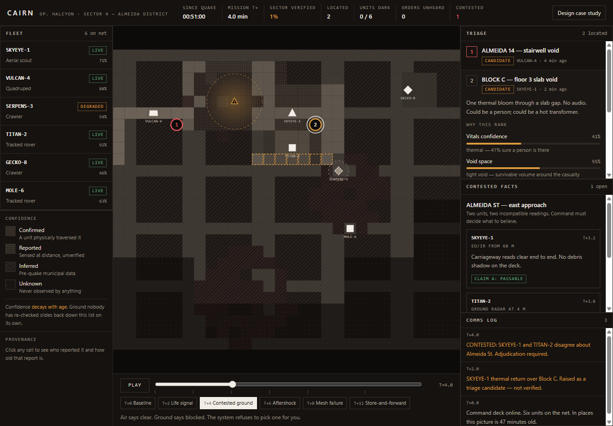

# CAIRN

**Command a robot swarm through a city you cannot see, using information you cannot fully trust.**

### ▶ [Open the live command deck](https://aaaditt.github.io/UXcelerate/)

*The incident plays itself — about 30 seconds end to end. Press space to pause, or jump straight to any beat.*

Submission for **UXcelerate!** — the IEI BPDC UI/UX challenge, 5–6 September 2026.
Forked from [ieibpdc/UXcelerate](https://github.com/ieibpdc/UXcelerate).

[](https://aaaditt.github.io/UXcelerate/)

<sup>**T+11 — store-and-forward.** MOLE-6 returns from three minutes of radio silence. Its observations are stamped `OCCURRED T+9.2` in the log because they arrived late, and the ground it physically drove has just **settled the argument** that two remote sensors could only disagree about.</sup>

---

> *A cairn is what people build to mark a safe route when there is no map.*

## The brief, and the reframe

> Design an interface for coordinating rescue robots after an earthquake, where maps may be incomplete, communication may be unreliable, and robots continuously discover survivors, blocked paths, structural hazards, and new accessible routes.

Read literally, that asks for a fleet dashboard. But every clause in it is about **not knowing things**. So the design question is not "how do we display six robots":

> **The commander's job is not to drive robots. It is to decide what to believe, and where to spend time they do not have.**

CAIRN's primary object is therefore a *decision under uncertainty*, not a fleet. That one move drives every other choice below.

## Four hard problems, four mechanics

| The brief says | CAIRN does |
|---|---|
| **Maps may be incomplete** | Confidence is drawn as **material** — solid, stipple, hatch, void — never as colour alone, so it survives greyscale and colour blindness. And it **decays with age**: ground nobody re-checks slides from *confirmed* → *reported* → *inferred* on its own. The map visibly forgets. |
| **Robots discover contradictions** | When the aerial unit says a street is clear and the ground unit says it is blocked, the system **refuses to silently pick a winner**. It raises a contested fact, attributes both claims with sensor and timestamp, and shows what each choice does to the triage order. |
| **Communication may be unreliable** | A dark unit is **never removed from the map**. It holds its last-known position inside an uncertainty ellipse that **grows as contact ages**. Orders queue instead of failing, and the fleet list counts *"orders this unit does not know about yet."* |
| **Continuous discovery** | Discoveries enter as **candidates to be triaged in**, never as toasts that vanish carrying the only copy of the information. The queue ranks *people*, shows its arithmetic, and states the counterfactual: *"rank 3 → rank 1 if Almeida St is confirmed passable."* |

## The idea that makes it work

Every event carries **two clocks**: `t` — when it happened — and `known` — when Command learned it. State is a fold that **filters on `known` but applies events in `t` order**.

```ts
state(T) = EVENTS.filter(e => e.known <= T)   // what Command has received
                 .sort(by e.t)                 // applied in occurrence order
                 .reduce(applyEvent, seed)
```

For a live unit the two clocks are identical. For MOLE-6 — dark at T+08, back at T+11 — they diverge, and its three minutes of observations arrive **already stale**, slotting into the timeline where they really belong.

**The map gains information about its own past.** Store-and-forward, the timeline scrubber, confidence decay, and "what did we know at T+04" are all the same query with a different bound. This is the rare case where the engineering choice and the design choice are the same choice.

## Walk it in 90 seconds

Six named beats, jumpable from the timeline or with keys `1`–`6`:

| | Beat | What to watch |
|---|---|---|
| **T+00** | Baseline | Most of the map is hatched — that is *pre-quake municipal data*, not ground truth. Sector verified: 2%. |
| **T+02** | Life signal | A thermal bloom over Block C enters triage as a **candidate**, at 41% vitals confidence. Open it — the ranking shows its arithmetic. |
| **T+04** | Contested ground | Air and ground disagree. Read both claims, then adjudicate. Watch the triage order and the map change together. |
| **T+06** | Aftershock | M4.6. Every *confirmed* cell in the district is demoted to *reported*. The picture rots in one step. |
| **T+08** | Mesh failure | Two units go dark. Their uncertainty ellipses grow. Dispatch one anyway — the order **queues**. |
| **T+11** | Store-and-forward | MOLE-6 returns with three minutes of the past. The comms log stamps them `occurred T+9.2`, and the backfill **settles the T+04 argument**. |

**Keyboard:** `space` play/pause · `1`–`6` jump to beat · `esc` clear selection
**In-app:** the full written case study is behind *Design case study* in the top right.

| | |
|---|---|
|  |  |
| **T+04 — the system refuses to choose.** Both claims are attributed with their sensor and timestamp. Until Command adjudicates, the contested cells stay impassable in every route we calculate. | **Every rank shows its arithmetic.** Vitals confidence, void space, corroboration, elapsed time and route trust — plus what would change the ordering. |

## Accessibility — stated honestly

An unverifiable conformance badge is worse than no badge, so:

**Lighthouse: accessibility 100, best practices 100, SEO 100** on the live build — after fixing the two real failures the first run surfaced. That score is a floor, not a certificate; it cannot see either gap listed below.

**Holds up.** No information is carried by colour alone — confidence is texture, triage order is a numeral, link state is a word. Body text meets WCAG AA contrast on the graphite surfaces, with a 14px floor. Every control is keyboard reachable with a visible focus ring. `prefers-reduced-motion` is respected. The map carries a text alternative summarising its state.

**Does not yet.** The SVG map is not fully keyboard navigable — cells are clickable but not tabbable, so a screen-reader user gets the summary and the panels but not per-cell provenance. Map callsigns render at 8.5px, breaking the 14px floor the design system sets for itself. Both are documented in [`docs/06-accessibility-audit.md`](docs/06-accessibility-audit.md) rather than hidden.

## Design system in one paragraph

**Colour is a scarce resource.** Real safety-critical equipment — ICU monitors, air traffic displays, INSARAG field kit — is not neon. Here colour only ever means risk or confidence; there is no brand accent. When something turns amber on this screen, it means something. Body text never drops below 14px, because dense tactical UIs habitually fall to 10px and lose all hierarchy exactly when load matters most. Telemetry uses tabular figures so columns do not jitter as they tick. Warm graphite, not blue-black — this should read as an instrument someone is accountable for, not a prop.

## Process documents

- [`01-research.md`](docs/01-research.md) — domain grounding and what real USAR interfaces get wrong
- [`02-personas.md`](docs/02-personas.md) — the Incident Commander and the Robot Operator
- [`03-user-flows.md`](docs/03-user-flows.md) — the three flows the deck is built around
- [`04-information-architecture.md`](docs/04-information-architecture.md) — why the screen is laid out this way
- [`05-design-system.md`](docs/05-design-system.md) — colour, type, the confidence encoding
- [`06-accessibility-audit.md`](docs/06-accessibility-audit.md) — measured, including the failures

## Stack

Vite · React 19 · TypeScript · Tailwind v4 · **plain SVG**.

No map vendor, no WebGL, no Three.js — deliberately. A heavy basemap renders nothing at all if anything goes wrong on a judge's laptop, and hand-drawing the map is what makes the confidence encoding possible in the first place. Everything is deterministic from a fixed seed, so the incident is identical on every run.

```bash
npm install
npm run dev
```

---

*Built for UXcelerate! 2026 · [Live deck](https://aaaditt.github.io/UXcelerate/) · [Competition repo](https://github.com/ieibpdc/UXcelerate)*
